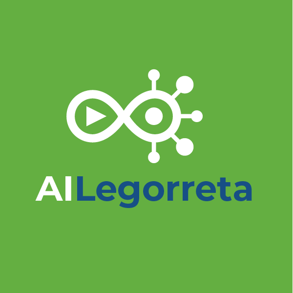
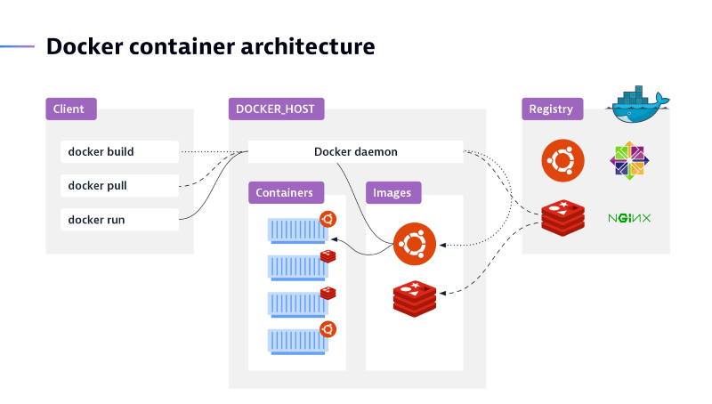
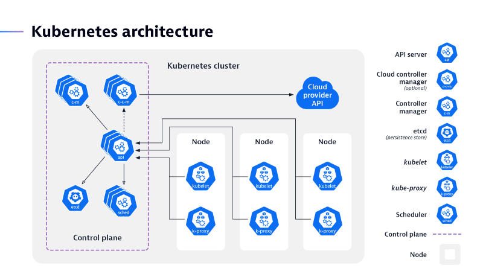

#  Marketplace

This repository contains the source code for all micro services, libraries and configurations to build a complete 
AI market place for different platforms : on-premise (docker desktop) or cloud kubernetes.

The purpose of these microservices are to minimize development time for any system developed by LegoSoft Soluciones, S.C. 
These are generic microservices and need to be adapted for the particular Client requirements, so
they can be copied inside Client projects but the ©Copyright it is still for LegoSoft Soluciones, S.C.. The Customer can use these
microservice and copy them as many times as he(she) likes, inside his(her) Company only.
## What is it?

The AI Legorreta marketplace is a set of generic microservices that can be utilized for a different systems types as 
a base or starting point for a development project. The objective is to reduce development time.

## List of microservices:

### AI Legorreta microservices:

* `iam-ui`: Vaadin user interface for the Identity Access Manager.
* `iam-service`: Back-end for Neo4j access to the Identity Access Manager. For docker solutions in the docker
  desktop thre instance are created for demonstration purpose `ima-service-1`, `iam-service-2` and `iam-service-3`.
* `preferenece-service` : Back-end to store per user preferences for grids or other widgets.
* `auth-service` : Spring authorization server [1.0.1] and logic to acces the LDAP and Neo4j users.
* `pyingestor`: Phyton docker that used Spark in order to ingest any data file.
* `udf-ui`: Vaadin user interface for UDF (User Defined Functions) administration. This microservice does not
  utilize the `udf-service` because it has a complete different API to store data in the UDF database.
* `udf-service`: Back-end for all microservices that utilize UDFs (User Defined Functions) like `cartera-ui`.
* `config-service`: Configuration service.
* `config-repo`: Configuration repository that it is stored in Github.
* `gateway-service`: Gateway with all custom filters and session management in Redis memory database.
* `cache-service`:  Cache for memory parameters stored in Redis memory database.
* `sys-ui`: System administrator user interface.
* `param-service`: System parameter service that stores the values in ParamDB.
* `mail-service`: Mail service to send mails from Kafka events.
* `audit-service`: Audit service that stores all events in a MongoDB.
* `cartera-ui`: A practical example for a portfolio management application.
* `cartera-service`: Back-end service for a practical example for a management application.
* `acme-ui`: User interface for an imaginary ACME Company.
* `bup-service`: Back-end for a Customer database in graph for an imaginary ACME Company.
* `expediente-service`: Back-end for s document administration for an imaginary ACME Company.
* `order-service`: Demonstration for `ingestor-service` adding sales orders for an imaginary ACME Company.
* `param-ingestor-service`: Demonstration for communication between `pyingestor` and Java with events.
* `udf-run`:  Phyton service for UDF (User Defined Functions).

### SpringBoot microservices.

These microservices are part of the ``Spring Boot [3.0.4]`` framework and are utilized as `gradle` dependencies or as `Spring initializr` generated proyect.
No project modification is done for almost all of these microservices:

* `Spring Config`: This microservice is just for docker development environmente (i.e., set enable flag to true). For
Kubernetes a better approach is used: Kustomize with ConfigMap and Secret. These tools are nativo to Kubernetes.
* `Spring Eureka`. This microservice is just for on-premise platform. For `Kubernetes` we use `Ingress`.
* `Spring Gateway`: In this microservice many code is added as filters.
* `Spring Security`: All frameworks for OAuth2 and OpenID Connect.
* `Spring MVC`
* `Spring Data`: For JPA, MongoDB and Neo4j graph databases.
* `Spring GraphQL`: For relational databases, MongoDB and Neo4j.

### Third party microservices:

* `Camunda`, includes: `elsaticsearch`, `zeebe` and two from Camunda BPM `tasklist` and `operate`. These are the minimum
docker images needed. Is the  Devop needs security more microservices are needed. See: (https://camunda.com) for more information.
* `Alfresco`, includes: `postgres-1`, `activemq-1`, `transform-core-aio-1`,`solr6-1`, `content-app-1` and for Alfresco
 specific microservices: `share-1`, `proxy-1` and `alfresco-1`. Different version os Alfresco are proposed so the  microservice list could vary
 depending on or what Alfresco configuration is chosen. See: (https://www.alfresco.com) for more information. 
* `Redis`: In memory database for two functions; for cache functionality between microservice communication (e.g., param 
  uses cache for  system parameters like system date, interest rate, etc ) and for session management in th Gateway in order to make session stateless.
* `Neo4j` : Single database for IAM (Identiy Access Management) and BUP. Thius can be two databases if it is a Custom requirement.
* `Observability`: This includes the following microservices: `grafana` , `prometheus`, `tempo` and `loki`. Future
observability microservices will be added o changed.
* `Kafka`: Used for events loosely coupled microservices (Domain Driven Design or DDD). Two microservices are needed:
`kafka` and `zookeeper`. note: future versions of Kafka will not need `zookeper`microservice.
* `Postgress`: Postgress where several databases are stores: AuthDB, ParamDB, CarteraDB, UDFDB, etc. If the Client requirements
needs an independent microservice this can be done, but we feel is impractical for demonstration purpose and for
production environment in ' Kubernetes`. It is only useful foe on-premise platform when the Custom wants resilence.
* `MongoDB`: MongoDB to store all auditory events.
* `Spark`, this includes the following images: `spark-master` and `spark-workers-n`.
* `LDAP`, includes the `ldap` directory and an administrator `ldapAdmin`.

note: These microservices are created as docker containers. For production mode this responsibility for the `kubernetes`environent to install them.

## Libraries

* Front-end libraries:
  * `Vaadin Flow` [24.0.0]. See: (https://www.vaadin.com) for more information.
  * `Vaadin Hilla` [2.0.0]. See: (https://hilla.dev/) for more information.
  * `Vaadin Hilla-react` [2.0.0] : Today there is not screen in `Vaadin Hilla React` but in the near future will
be added. See (https://hilla.dev/) for more information.

* Front-end add-on's and Javascript libraries:
  * `crud-ui` : Vaadin flow CRUD catalogs.
  * `d3.js` : Graph representation for IAM (Identity Access Manager) permits, roles, profiles, users, companies, etc.
  * `blockly.js`: Google javascript library. See (https://developers.google.com/blockly) for more information
  * `Excel exporter`: Vaadin Flow Grid exporter to Excel files.
  * `visjs-network`: Vaadin add-omn for viss.js library. Displays graphs in the BUP microservice.
  * `CKEditor.js`: CKEditor to edit any template or document as an HTML.

note:  All Vaadin Flow add-ons the source is included in this project to avoid future version changes.

* AI Legorreta kit [2.0.0]:
  * `ai-legorreta-kit-client`: includes documentation in how to use these Vaadin client libraries.
      * `ai-legorreta-kit-client-blockly`: wrapper for blockly.js.
      * `ai-legorreta-kit-client-bpm`: Camunda BPM manual tasks are displayed as Vaadin views.
      * `ai-legorreta-kit-client-components`: extra Vaadin components.
      * `ai-legorreta-kit-client-crud-ui`: Vaadin CRUD ui wrapper.
      * `ai.legorreta-kit-client-dataproviers`: Vaadin data providers for Neo4j, MongoDb and other databases. Supports
    paging.
      * `ai-legorreta-kit-client-exporter`: Vaadin grid Excel component wrapper exporter.
      * `ai-legorreta-kit-client-mobile-security`: To handle PWA security inside an iPhone or Android.
      * `ai-legorreta-kit-client-navigation`: Vaadin flow menu navigator.
      * `ai-legorreta-kit-client-preferences`: Vaadin flow components to add or delete user preferences.
      * `ai-legorreta-kit-client-security`: Common web (ui) security filters.
      * `ai-legorreta-kit-client-visjs-network`: Visjs-network wrapper to display visjs graphs in Vaadin.
      * `ai-legorreta-kit-client-litelement-ckeditor`: Vaadin wrapper for the CKEditor.js library.
    * `ai-legorreta-kit-commons`: libraries that are common between fron-end or back-end microservices.
      * `ai-legorreta-kit-commons-cmis`: API CMIS[1.0.0] in order to communicate to Alfresco content management.
      * `ai-legorreta-kit-commons-event`: Kafka DTOs records.
      * `ai-legorreta-kit-commons-preference`: Preferences DTOs records.
      * `ai-legorreta-kit-commons-utils`: Java and Kotlin Utils.
    * `ai-legorreta-kit-data-jpa`: Utilities for Spring Data JPA.
    * `ai-legorreta-kit-data-mongodb`: Utilities for Spring Data MongoDB.
    * `ai-legorreta-kit-data-neo4j`: Utilities for Spring Data Neo4j graph database.
    * `ai-legorreta-kit-resource`: Libraries for all back-end microservices.
      * `ai-legorreta-kit-resource-security`: Spring security utilities for back-end microservices.

## Prerequisites

* Java 17+
    * OpenJDK: [Eclipse Temurin](https://adoptium.net) or other JDK will work
    * GraalVM: [GraalVM](https://www.graalvm.org) for newer Market Place [2.1.0+] version.
    * JDK Management: [SDKMAN](https://sdkman.io)
* Kotlin 1.8+
* Python 3.7.15+
* Vaadin 24.0.0+
* Hilla 2.0.0+
* Docker 20.10+
    * [Docker for Linux](https://docs.docker.com/engine/install/ubuntu/)
    * [Docker Desktop for Mac](https://www.docker.com/products/docker-desktop)
    * [Docker Desktop for Windows](https://www.docker.com/products/docker-desktop)
* Kubernetes 1.24+
    * [kubectl](https://kubernetes.io/docs/tasks/tools/install-kubectl/)
    * [minikube](https://minikube.sigs.k8s.io/docs/)
* Other
    * [IntelliJ Ultimate](https://intellij.com/)
    * [Visual Studio Code](https://code.visualstudio.com/)
    * [HTTPie](https://httpie.org/)

## Development patterns

All the development tried to follow the following best patterns defined in these books:

* [Spring microservices in Action [2nd Edition]](https://www.manning.com/books/spring-microservices-in-action-second-edition) by Carnell Sanchez:
in some cases we did not follow the strict microservice patter specially in the database containers
  (or pods). For example there is just one instance of `Neo4j` database. This can be adapted if they  do not follow the Clients infraestructure
needs (e.g., have as many `Neo4j` containers as microservices). But all the data schemas where independent of microservice.
* [Cloud Native Spring in Action with Spring Boot and Kubernetes](https://www.manning.com/books/cloud-native-spring-in-action) by Thomas Vitale:
This book was the guidance for the project structure and file configurations foor develoment (docker containers) and for production (kubernetes minikube).
* [Microservices in Action](https://www.manning.com/books/microservices-in-action) by Bruce Pereira.
* [Microservice Patterns](https://www.manning.com/books/microservices-patterns) by Chris Richardson.

## Gradle and Maven

All microservices and libraries use `gradle` and few of them use `maven`. 

Should you prefer Maven or Gradle, here's a table mapping Gradle commands to Maven.

| Gradle                     | Maven                            |
|----------------------------|----------------------------------|
| `./gradlew clean`          | `./mvnw clean`                   |
| `./gradlew build`          | `./mvnw install`                 |
| `./gradlew test`           | `./mvnw test`                    |
| `./gradlew bootJar`        | `./mvnw spring-boot:repackage`   |
| `./gradlew bootRun`        | `./mvnw spring-boot:run`         |
| `./gradlew bootBuildImage` | `./mvnw spring-boot:build-image` |

## History of Marketplace

### Version 1.X

For this version we collect all expertise from different developmentssince 2018 and separate them as microservices. This
was developed during 2021-2023.

Goals:
* Uniform standard development & libraries.
* New GraphQL interace for relational databases.
* New GraphQL interface and DSK for Neo4j database.
* Instead us use Activity BPM migrate to Camunda BPM.
* New Notification microservice.
* Upgrade versions of Java 17+, Spring Boot 3, Spring Security 6, Vaadin 24 and Hilla 2.0.
* New use of Spring Authorization Server
* User Docker desktop as on-premise platform.
* New BUP in a graph database.
* New ingestor.
* Many more.

### Version 2.X

The main functionality was kept the same. The main difference is to migrate the Desktop microservice on-premise
platform to a Cloud Native Kubernetes platform. In other words, the marketplace can be executed on-premise using
Docker desktop for development environment and for Cloud production environment as a native Application with Kubernetes.

note: If the Customer needs are on-premise but with resilence, the modification are minimum to the development
environment. That is to include a service discovery Eureka and the `@loadBalanced` directives as version 1.X, or use
version 1.x with no modifications.

Goals:
* Deploy for production environment a Kubernetes microkube.
* For development environment still use Docker desktop.
* Use patterns found in Spring Cloud Native Application book. Some od them are:
  * Better project structure.
  * Better naming convention.
  * Use more Java 17+ functionality (e.g., records & lambdas).
  * Use `gradle` instead of `maven` in order to keep the files shorter (with the excpetion of libraries).
* Use Kubernetes service discovery called `Ingress`and remove `Spring Eureka`.
* Make all microservices stateless.
  * note: For Vaadin Flow application a Kubernetes kit must be included. This kit needs a commercial license so it is
  not included in this repository.
* Rename all packages and libraries for new brand `AI Legorreta®`.

#### Migration Docker architecture to Kubernetes

While Docker is a container runtime, Kubernetes is a platform for running and managing containers from many container 
runtimes. Kubernetes supports numerous container runtimes including Docker, container, CRI-O, and any implementation 
of the Kubernetes CRI (Container Runtime Interface).

The docker image is shown in this figure:

And the Kubernetes architecture is shown:

Where the main differences in terms of migration are:
* The docker images are deployed in Kubernetes with the `Titl` files.
* The service discovery and load balanced is done by Kubernetes.
* Create new instance (or replicas) in Kubernetes is easier. The automatically 'down-sizing' functionality is just 
for Kubernetes. So for Cloud deployment Kubernetes is more efficient in resources utilization, so less $. 
* All containers must be stale-less.
* And od course Kubernetes runs as a cluster. Docker runs in a single node (cluster).

## Future improvements:

Since this is continuous work the following development activities are in process (May 2023):

| Activity               | Comment                                             |
|------------------------|-----------------------------------------------------|
| `Authorization`        | Voting for back authorization.                      |
| `Flyway for Neo4j`     | Use `Flyway`instead of cypher scripts.              |
| `Real-time Neo4j`      |                                                     |
| `Ingestor with OCR`    | Include OCR inside the `ingestor`                   |
| `Excel exporter`       | `Vaadin` excel exporter add-on. Newest version.     |
| `Vaadin PWA in mobile` | Use mobile camera inside `Vaadin`                   |
| `Config with Vault`    | User vault for configuration instead a repository.  |
| `Drools`               | Include a rule machine `Drools` inside `Camunda`.   |
| `Ingestor`             | Use ingestor with a report generator like `Jasper`. |
| `Ingestor`             | Add more validations.                               |

### Contact AI Legorreta

Feel free to reach out to AI Legorreta on [web page](https://legosoft.com.mx).

Version: 2.0
©LegoSoft Soluciones, S.C., 2023
